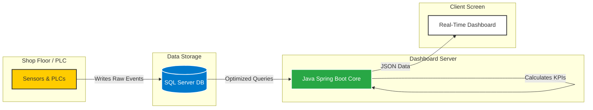

# VECV SCADA Reporting System - Client Manual

**Project Name:** VECV Pull Chord Report Dashboard  
**Version:** 2.0  
**Developed By:** ATS India  
**Date:** January 2026

---

## 1. Executive Summary
This dashboard provides a real-time visualization of production line performance at VECV. By connecting directly to the shop floor PLCs via an SQL Server database, it empowers the management and maintenance teams to:
*   **Monitor** live production status across zones (Z3, Z5, Z7, Z9).
*   **Analyze** breakdown trends, MTBF (Reliability), and MTTR (Repair Speed).
*   **Reduce** downtime by identifying top failing stations and recurring issues.

## 2. Key Features
*   **Real-Time Data**: The dashboard updates automatically every 30 seconds.
*   **Smart Analytics**:
    *   **Breakdown Trend**: Percentage of time lost to stops.
    *   **MTBF & MTTR**: Critical KPIs for maintenance planning.
    *   **Top 5 Stations**: Instantly see which stations cause the most downtime.
*   **One-Click Reports**: Export filtered data to Excel for offline meetings.
*   **Hybrid Performance**: Runs on a high-speed engine that processes huge datasets in <1 second.

## 3. System Architecture Flowchart
The following diagram illustrates how data flows from the shop floor to your screen.

## 4. How to Use the Dashboard
1.  **Access**: Open Chrome/Edge and navigate to `http://localhost:8070` (or your specific server IP).
2.  **Navigation**:
    *   **Analytics Tab**: Review charts and graphs.
    *   **Reports Tab**: View detailed line-by-line event logs.
3.  **Filtering**:
    *   Use the top filter bar to select a specific **Station**, **Shift**, or **Date Range**.
    *   Click **"Filter"** to update the data.
4.  **Download**: Click the green **"Excel"** button to download the currently viewed report.

## 5. Support & Troubleshooting
*   **No Data?** Ensure the correct Table and Date Range are selected.
*   **System Slow?** Check if "Performance Mode" is set to "Fast" (Top Right Toggle).
*   **Red Status Dot?** Check network connection to the server.

---
*Confidential Property of VECV. For Internal Use Only.*
