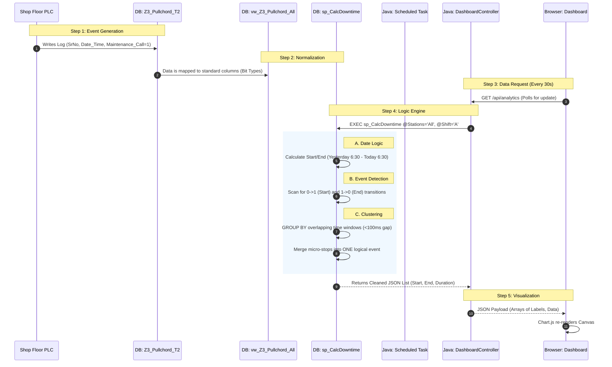

# Deep Dive Data Journey: From PLC to Pixel

This document explains the **minute-by-minute lifecycle** of a single "Pull Chord" event, detailing exactly how data moves from the shop floor to the dashboard.

## 🌟 The Full Journey Map (Visual)

---

## 🔍 Detailed Data Stages

### Stage 1: The Raw Signal (The "Minute" Detail)
*   **Actor**: Assembly Line PLC (Programmable Logic Controller).
*   **Action**: An operator pulls the cord at **Station-10**.
*   **Effect**: The PLC writes a row to the table `Z3_Pullchord_T2`.
    *   `SrNo`: 100501
    *   `Date_Time`: 2026-01-29 10:05:01.000
    *   `Maintenance_Call`: **1** (Active)
    *   `Station`: "ST-10-Eng-Mount"

*(One minute later, the operator resets the cord)*
*   **Effect**: PLC writes another row.
    *   `SrNo`: 100599
    *   `Date_Time`: 2026-01-29 10:06:01.000
    *   `Maintenance_Call`: **0** (Inactive)

### Stage 2: Database Normalization (The "View")
The application rarely touches the raw table directly. Instead, it looks at `vw_Z3_Pullchord_All`.
*   **Why?** To ensure that `Maintenance_Call` is treated as a boolean (0/1) regardless of the raw data type (sometimes raw PLCs send 'True'/'False' text).
*   **Code Reference**: `sp_setup.sql` (Line 60).

### Stage 3: The Calculation Engine (Stored Procedure)
When you open the dashboard, `sp_CalcDowntime` runs. This is the **Brain** of the system.
1.  **Date Logic**: It figures out "What is 'Today'?". In manufacturing, a day starts at 06:30 AM.
    *   *Example*: If it's 2 AM on Jan 30th, the system knows it's still "Jan 29th Shift C".
2.  **Event Pairing (LAG Function)**: It looks at the row stream.
    *   It finds the `1` (Start) at 10:05:01.
    *   It finds the usage of `0` (End) at 10:06:01.
    *   It pairs them: **Duration = 60 Seconds**.
3.  **Clustering**:
    *   *Problem*: Sometimes a loose wire causes the signal to flicker 1-0-1-0 fifty times in a second.
    *   *Solution*: The SP groups anything happening within 100ms into a **Single Cluster**. This prevents the chart from showing 50 tiny breakdowns.

### Stage 4: API Delivery (Spring Boot)
*   **File**: `DashboardController.java`
*   **Method**: `getAnalytics()`
*   **Action**: It calls the Stored Procedure, converts the SQL ResultSet into a Java List of Maps (`List<Map<String, Object>>`), and converts that to JSON.

### Stage 5: Final Rendering (Browser)
*   **File**: `KD_VECV_NewClientDemoUI.html`
*   **Action**: JavaScript receives the JSON.
    *   `breakdownChart` (Chart.js) receives the new data array.
    *   `update()` is called.
    *   The bars animate to the new height.
    *   **Total Time**: ~200ms from server response to pixels on screen.
