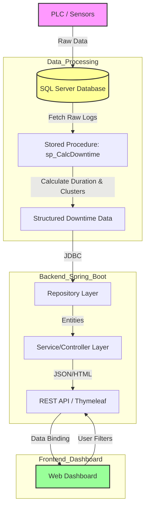

# Project Data Flow & Architecture

This document outlines the high-level architecture and data flow of the VECV PullChord Report System.

## System Architecture

The system is designed as a **3-Tier Application**:
1.  **Data Layer (MSSQL)**: Stores raw production data from PLCs and processed downtime events.
2.  **Application Layer (Spring Boot)**: Fetches data, calculates KPIs, and serves the frontend.
3.  **Presentation Layer (HTML/JS)**: Dynamic dashboard for visualization.

## Data Flowchart

## Component Details

### 1. Database (MSSQL)
*   **Tables**: `Z3_Pullchord_T2`, `Z5_Pullchord_T` (Raw Data).
*   **Stored Procedures**: 
    *   `sp_CalcDowntime`: handles complex logic to merge overlapping downtime events and calculate "Cluster Downtime".
    *   `sp_setup`: Initializes the database tables.

### 2. Backend (Java Spring Boot)
*   **Controller**: `DashboardController.java` - Handles HTTP requests and filter logic.
*   **Repository**: `Z3PullchordT2Repository.java` - Interfaces with the database.
*   **Logic**:
    *   **Live Mode**: Fetches data directly using JPA.
    *   **Optimized Mode**: Calls `sp_CalcDowntime` for high-performance reporting.

### 3. Frontend (Web)
*   **Technology**: HTML5, CSS3, JavaScript (Chart.js).
*   **Features**:
    *   Real-time polling (every 30s).
    *   Responsive Charts (Breakdown, MTBF, MTTR).
    *   Excel Download capability.
